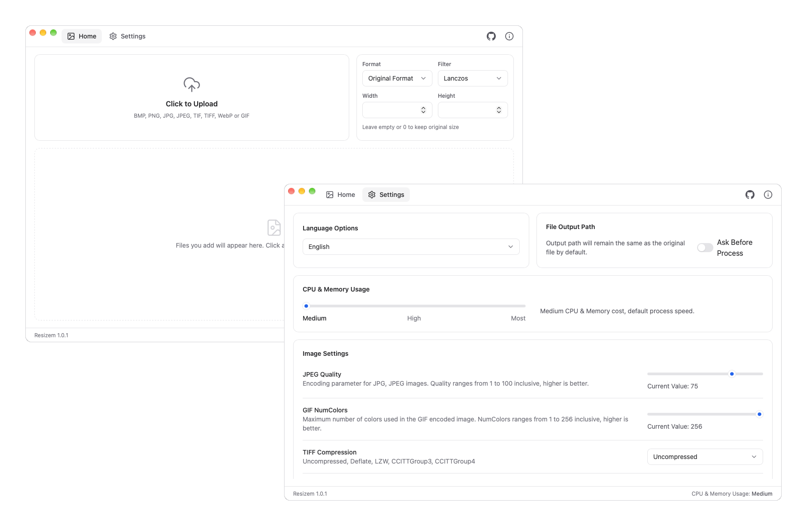

# Resizem


**Resizem (combine "resize" with "them")** is an app designed for **bulk image process.**  It is particularly useful for users who need to resize, convert, and manage large numbers of image files at once. It supports a variety of formats like JPG, JPEG, PNG, GIF, BMP, TIFF and WebP. It also allows you to set custom dimensions while ensuring the quality of the image remains intact (with resampling filters).



<p align="center">
<a target="_blank" href="https://github.com/barats/resizem/stargazers"></a> 
&nbsp;&nbsp;&nbsp;
<a target="_blank" href="https://gitee.com/barat/resizem/stargazers"></a>
</p>

## Features

1. Bulk image reszie and convert
1. Simple & easy UI with support for custom settings
1. Rich format support: JPG,JPEG,PNG,GIF,BMP,TIF,TIFF and WebP
1. Multiple resamping filters: NearestNeighbor, Box, Linear, Hermite, MitchellNetravali, CatmullRom, BSpline, Gaussian, Lanczos, Hann, Hamming, Blackman, Bartlett, Welch, Cosine  

## Technical details

**Resizem** uses **Golang** to do the "resize and convert" work and **Svelte** + **Flowbite Svelte** + **TailwindCSS** for frontend work.  
 
**This is glued together as a single binary with native rendering by the fantastic [Wails](https://wails.io) framework.**

## Download and installation

Resizem can run on the following operating systems:

1. Windows 10/11 amd64/arm64
1. Linux amd64/arm64
1. macOS 10.13+ amd64 (Intel)
1. macOS 11.0+ arm64 (Apple Silicon)

## Pre-compiled binaries

You can obtain a pre-compiled Resizem binary for macOS/Windows/Linux from the [release page](https://github.com/barats/resizem/releases).

## Compiling from source

Before building Resizem, please prepare the building environment as follows:

1. Download Go 1.25+ from the [Go Download Page](https://go.dev/dl/)
2. Download Node.js 22+ from the [Node.js Download Page](https://nodejs.org/)
3. Install Wails v2.14.0 (the latest v2 release) via `go install github.com/wailsapp/wails/v2/cmd/wails@v2.14.0`, see the [Wails Installation Page](https://wails.io/docs/gettingstarted/installation/)
4. Go to the project home path and run `wails build`, more build flags can be found at the [Wails CLI Reference](https://wails.io/docs/reference/cli#build)

To build release artifacts for all platforms, use the included Makefile:

- `make release` — build release artifacts for the current host (macOS + Windows when run on a Mac)
- `make release-macos`, `make release-windows`, `make release-linux` — build a specific platform
- `make release-linux` requires a Linux host; the GitHub Actions workflow (`.github/workflows/release.yml`) builds all three platforms in CI

Artifacts are written to `build/bin/`.

## License 

```
Copyright (c) [2024] [Barat Semet]
[Resizem] is licensed under Mulan PSL v2.
You can use this software according to the terms and conditions of the Mulan PSL v2.
You may obtain a copy of Mulan PSL v2 at:
         http://license.coscl.org.cn/MulanPSL2
THIS SOFTWARE IS PROVIDED ON AN "AS IS" BASIS, WITHOUT WARRANTIES OF ANY KIND,
EITHER EXPRESS OR IMPLIED, INCLUDING BUT NOT LIMITED TO NON-INFRINGEMENT,
MERCHANTABILITY OR FIT FOR A PARTICULAR PURPOSE.
See the Mulan PSL v2 for more details.
```

## Give Thanks To 

1. [Wails.io](https://wails.io) - Amazing project that could build cross-platform applications using Go
1. [Flowbite Svelte](https://flowbite-svelte.com) - Official Flowbite component library for Svelte
1. [TailwindCSS](https://tailwindcss.com) - A utility-first CSS framework that can be composed to build any design, directly in markup
1. [disintegration/imaging](https://github.com/disintegration/imaging) - Amazing yet simple image processing package for Go 

## Collaboration

If you find this app useful, or are interested in open source collaboration, you can try:

1. Provide feedback on problems encountered while you're using this app
1. Explore source code and submit appropriate and necessary PRs
1. Translate this app into other languages(put language files in `frontend/src/lib/i18n/locales/` and draft new PR)

