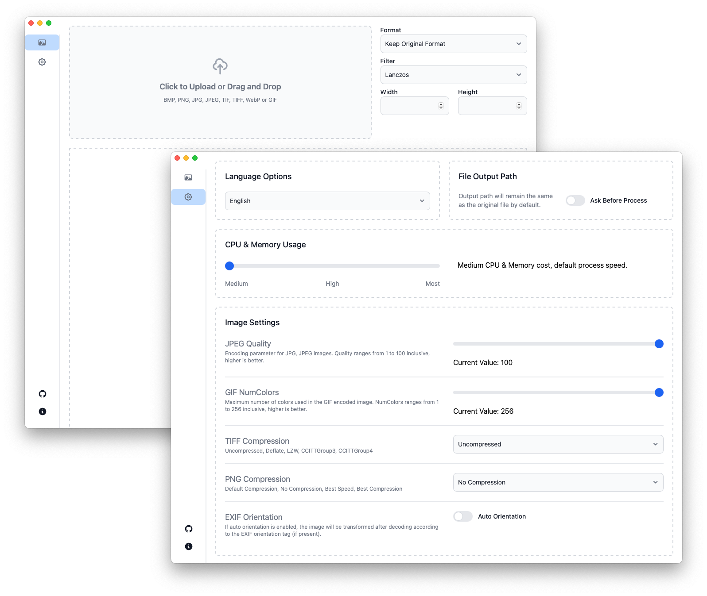

# Resizem

**Resizem (将resize与them组合)** 是一款专为批量处理图片而设计的应用软件。对于需要同时调整、转换和管理大量图片文件的用户来说，这款应用尤其有用。它支持多种格式，如 JPG、JPEG、PNG、GIF、BMP、TIFF 和 WebP。它还允许您设置自定义尺寸，同时确保图片质量保持不变（使用重采样滤镜）。



## 主要功能

1. **批量**图片等比缩放/扩大，以及类型转换
1. 简单易用的用户界面，支持自定义设置
1. 丰富的图片类型支持，包括： JPG,JPEG,PNG,GIF,BMP,TIF,TIFF 和 WebP 格式
1. 多种过滤器支持：NearestNeighbor, Box, Linear, Hermite, MitchellNetravali, CatmullRom, BSpline, Gaussian, Lanczos, Hann, Hamming, Blackman, Bartlett, Welch, Cosine  

## 技术细节

**Resizem** 使用 **Golang** 实现 ”图片缩放/扩大和类型转换“ 后端功能；软件界面部分，采用了 **Svelte** + **Flowbite Svelte** + **TailwindCSS** 的纯前端技术
 
**至于Golang后端和前端程序之间的“通信”和“打通”等问题，使用非常优秀的 [Wails](https://wails.io) 框架实现**

## 开源协议 

**Resizem** 遵循国产《木兰宽松许可协议》

```
Copyright (c) [2024] [Barat Semet]
[Resizem] is licensed under Mulan PSL v2.
You can use this software according to the terms and conditions of the Mulan PSL v2.
You may obtain a copy of Mulan PSL v2 at:
         http://license.coscl.org.cn/MulanPSL2
THIS SOFTWARE IS PROVIDED ON AN "AS IS" BASIS, WITHOUT WARRANTIES OF ANY KIND,
EITHER EXPRESS OR IMPLIED, INCLUDING BUT NOT LIMITED TO NON-INFRINGEMENT,
MERCHANTABILITY OR FIT FOR A PARTICULAR PURPOSE.
See the Mulan PSL v2 for more details.
```

## 特别鸣谢

1. [Wails.io](https://wails.io) 
1. [Flowbite Svelte](https://flowbite-svelte.com)
1. [TailwindCSS](https://tailwindcss.com)
1. [disintegration/imaging](https://github.com/disintegration/imaging)